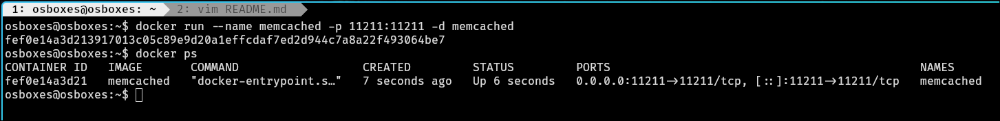
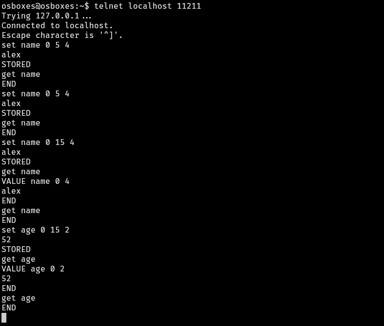
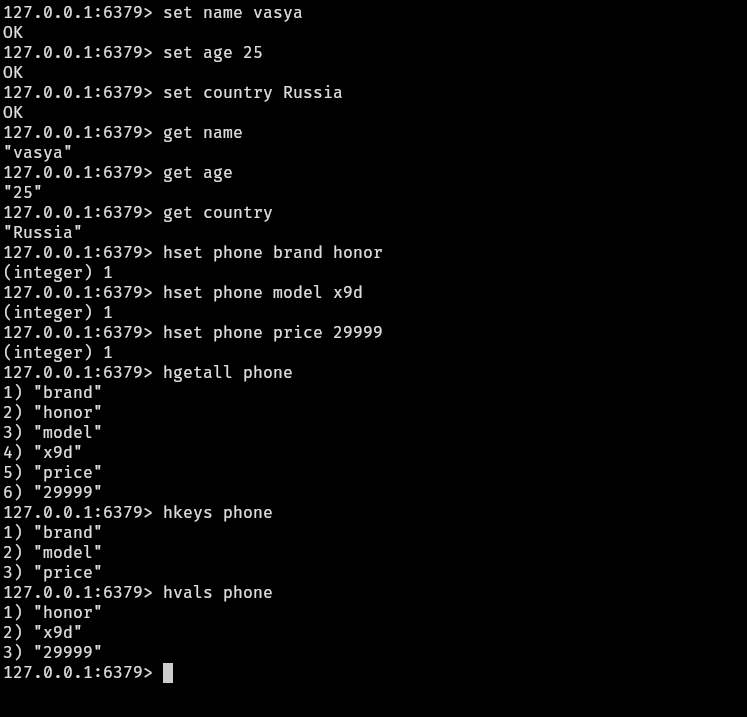

# Домашнее задание к занятию "Кеширование Redis/memcached" - Валик Александр

### Задание 1

1. Какие проблемы помогает решить кешироване.

| Проблема | Решение кешированием |
| ----------------------------------------------- | -------------------------------------- |
| Высокая задержка доступа к БД/диску | Хранение данных в ОЗУ, микросекундный доступ |
| Перегрузка БД тысячами запросов | Приём на себя ~90% чтения, снижение RPS на БД |
| Повторные дорогие вычисления | Однократное вычисление, многократное использование |
| Отказы бэкенда / БД | Fallback на кэшированную копию (graceful degradation) |

 ===

### Задание 2

Установлен и запущен memcashed на VM.

 ===

### Задание 3

В memcached записаны ключи, для которых выставлен TTL 5.

 ===

### Задание 4

В Redis записаны несколько кдючей. С помощью redis-cli эти ключи прочитаны из базы.

